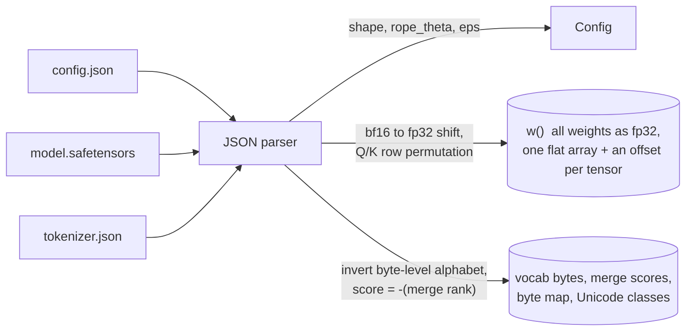
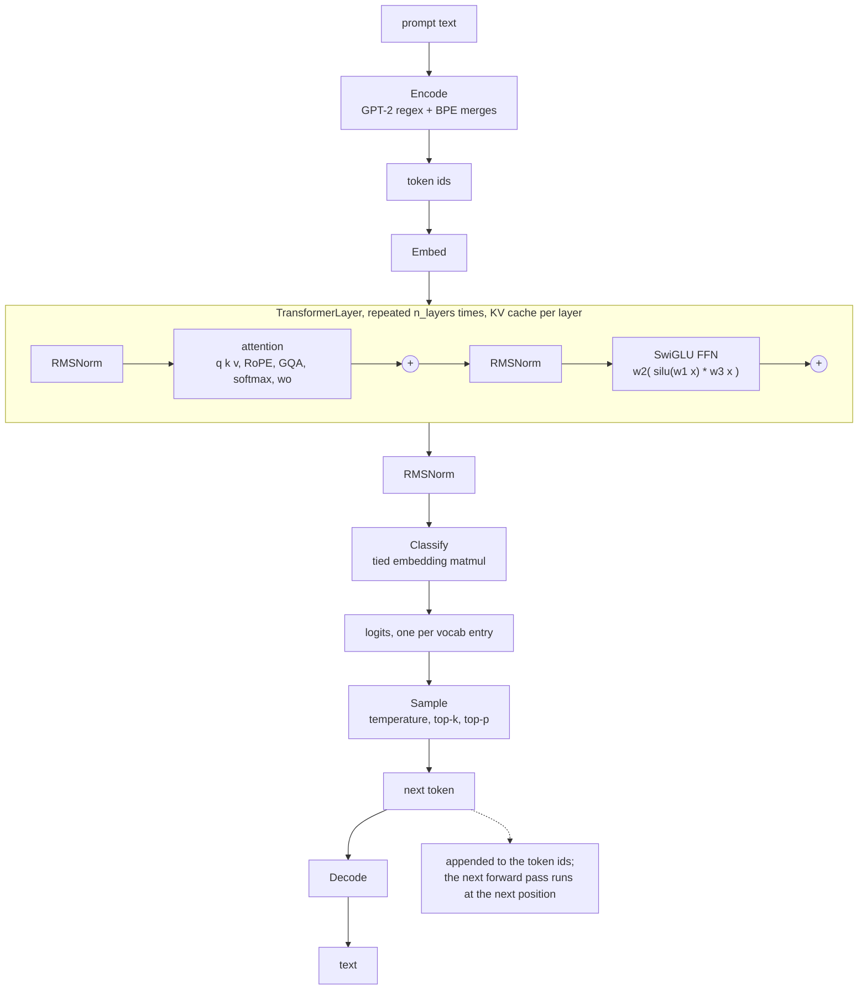

# GOTOken

A language model inference engine written in BASIC. It runs
[SmolLM2-135M](https://huggingface.co/HuggingFaceTB/SmolLM2-135M), a
Llama-architecture model, in [QB64](https://qb64.com), and produces the same
tokens as HuggingFace `transformers` does. It reads the HuggingFace
checkpoint files directly: from `config.json`, `model.safetensors` and
`tokenizer.json` to generated text, everything is BASIC.


```
$ docker run -it gotoken
GOTOken: SmolLM2-135M in BASIC. Type a prompt and press enter; /quit to leave.
temperature .7  top-p .9  top-k 0  steps 64
> Once upon a time, there was a wise old owl named Oscar. Oscar lived in a
big, beautiful forest filled with tall trees, sparkling streams, and colorful
flowers. One day, Oscar had an idea - why not start a nonprofit organization?
[ 64 tokens, 67 forwards, 65.6 s ]
```

It is a learning project: the whole engine is about 1500 lines of BASIC that
map almost one to one onto karpathy's [llama2.c](https://github.com/karpathy/llama2.c),
and every piece was verified numerically against the real model before the
next was added. The story of how it came together is in the blog post
[GOTOken: an inference engine in QBasic](https://bmuskalla.dev/blog/2026-09-13-gotoken-inference-engine-in-qbasic/).

Two halves. Loading turns the checkpoint files into one flat weight array
and the tokenizer's tables:



Generating is run.c's loop: one forward pass per token, the result fed
back in.



## Try it with Docker

Nothing to install beyond Docker. A prebuilt image for amd64 and arm64 is
on Docker Hub:

```bash
docker run -it bmuskalla/gotoken
```

That starts the REPL (`-it` matters: it reads your terminal). Type a
prompt, get a continuation, token by token. Other commands run the same way:

```bash
docker run bmuskalla/gotoken complete 32 "The capital of France is"
docker run bmuskalla/gotoken encode "Hello world"
docker run bmuskalla/gotoken info
docker run -it bmuskalla/gotoken repl 1.0 0.9 40 7     # temperature, top-p, top-k, seed
```

Expect about one token per second, after four seconds of loading. The
engine is plain unoptimized BASIC compiled with no optimization flags, doing
134 million multiply-adds per token in a triple loop. The KV cache keeps
that constant as the text grows.

## Usage

```
gotoken repl [temp] [topp] [topk] [seed]   interactive; one prompt per line
gotoken complete <max_tokens> "<text>"     one greedy completion, stops at end of text
gotoken encode "<text>"                    text -> token ids, with the pre-tokenizer chunks
gotoken decode <id> [<id> ...]             token ids -> text
gotoken info                               model info and the weight checksum
```

Inside the REPL: `/temp 0.3`, `/topp 0.95`, `/topk 40`, `/seed 1`,
`/steps 128`, `/quit`. Every line is a fresh prompt. The defaults are
temperature 0.7, top-p 0.9, 64 tokens. Temperature 0 is greedy and
deterministic; around 0.7 the model tells a different story each time;
above 1.2 it falls apart. Seeds make sampled output reproducible.

The commands used for verification (`logits`, `kernels`, `layer`,
`forward`, `generate`, `generate-nocache`, `sample`, `encode-batch`) print
numbers for the Python oracle to parse; the header of `gotoken.bas` lists
them all.

## Build it yourself

```bash
docker build -t gotoken .
docker run -it gotoken
```

The build downloads the model from HuggingFace (about 270 MB, three
files: `config.json`, `model.safetensors`, `tokenizer.json`), compiles QB64
2.1 from its release tarball and then the engine, and leaves a slim image
with just the binary and the model. See the [Dockerfile](Dockerfile).

Without Docker, the same two steps are `./fetch-model.sh` and `./build.sh`,
with QB64 2.1 from [qb64.com](https://qb64.com) at `~/qb64/qb64` (or set
`QB64`). `GOTOKEN_MODEL` points the engine at a different model directory.

## How it works

```
gotoken.bas         main program and command dispatch
src/json.bi/.bm     a small JSON parser for the three checkpoint files
src/model.bi/.bm    config.json and model.safetensors -> one flat SINGLE
                    array holding all 134.5M weights, an offset per tensor
                    (run.c's memory_map_weights without pointers)
src/kernels.bm      MatMul, RmsNorm, Softmax
src/forward.bm      Embed, Rope, TransformerLayer, Forward, Classify
src/generate.bm     the autoregressive loop, with the KV cache
src/sampler.bi/.bm  temperature, top-k, top-p, seeded xorshift64*
src/tokenizer.bi/.bm  tokenizer.json -> byte-level BPE with the GPT-2 pre-tokenizer regex
src/unicode.bm      codepoint ranges for \p{L}, \p{N}, \s as string tables
src/checks.bm       printers for the verification commands
fetch-model.sh      downloads the three checkpoint files with curl
oracle/oracle.py    the Python oracle: reference values from the real model, comparisons
oracle/bpe_ref.py   the tokenizer in Python against tokenizer.json, as a spec
FORMAT.md           what the loader makes of the checkpoint, and the memory layout
```

QB64 has no modules, only textual `$INCLUDE`: declarations (`.bi`) go before
the main program, subs and functions (`.bm`) after it.

A forward pass is run.c's `forward()`: look up the token's embedding row,
run 30 layers of pre-norm attention (9 query heads sharing 3 key/value
heads, rotary positions) and SwiGLU feed-forward on the residual stream,
normalize, and multiply by the tied embedding table to get 49152 logits.
The sampler turns those into one token; the tokenizer turns tokens into
bytes. All arithmetic is fp32 (BASIC `SINGLE`).

Loading is the engine's own work too: it parses the safetensors header and
tokenizer.json with a 250-line JSON parser, converts bf16 weights to fp32
with a 16-bit shift, reorders the Q and K rows for run.c's RoPE layout, and
inverts GPT-2's byte-level alphabet to get raw token bytes. Details that
llama2.c hardcodes and this model needs differently (rope_theta 100000, the
RoPE pair layout) are handled there; see [FORMAT.md](FORMAT.md).

## Limits

One token per second, four seconds to load, 1.1 GB of memory (fp32
weights plus caches), a
1024-token context (the model allows 8192; one constant in
`src/forward.bm`), no batching, no chat template (it is a base model, it
continues text). Special tokens typed into a prompt are treated as plain
text. The obvious next step, int8 weights with per-row scales, is step 9
of the plan and has not been done.

## License

Apache 2.0, see [LICENSE](LICENSE). The model, SmolLM2-135M from HuggingFace,
is Apache 2.0 as well.
